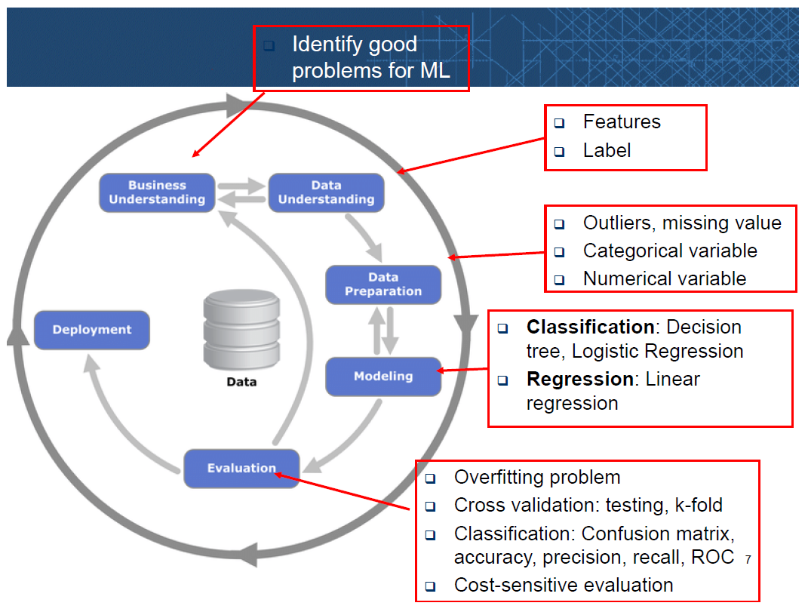
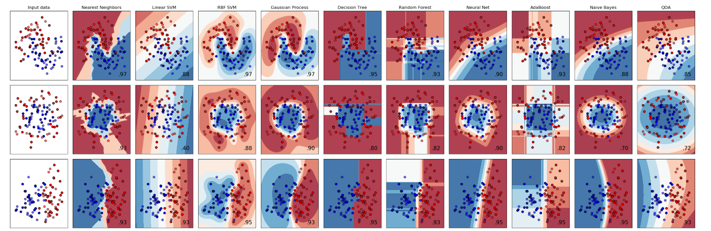
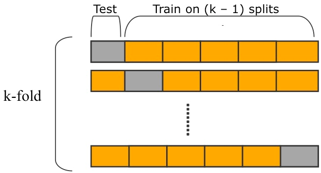
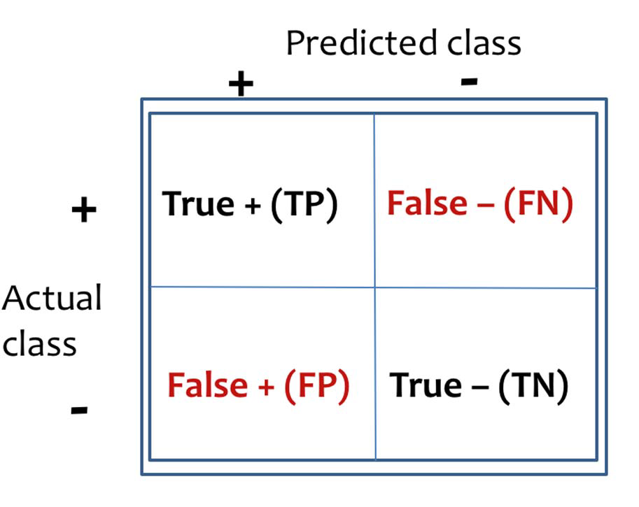
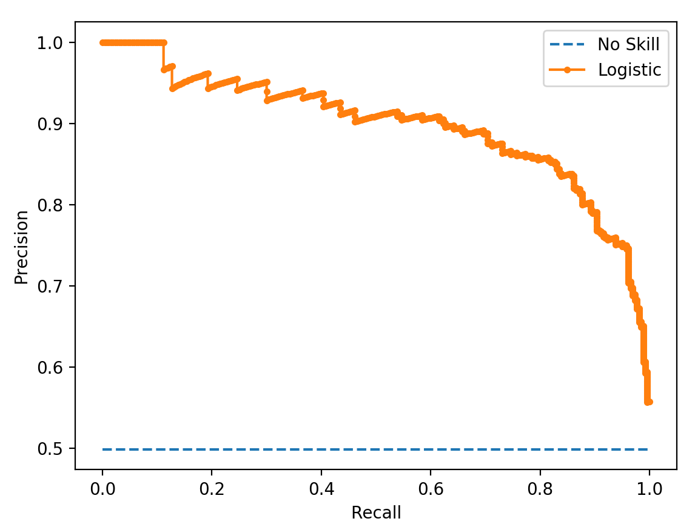
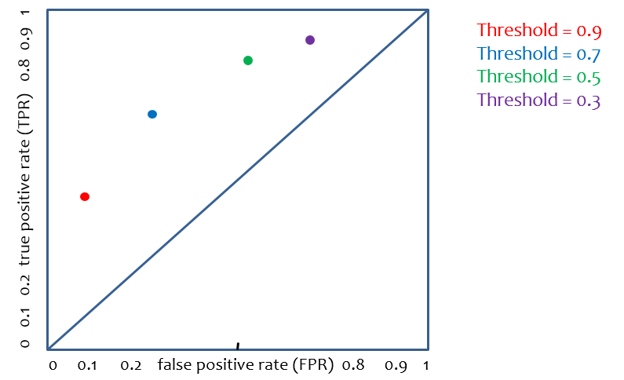
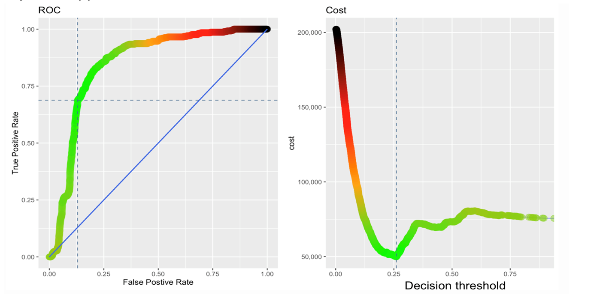

# ISOM 3360

ISOM 3360 - Data Mining for Business Analytics

Spring 2020, HKUST

This repository contains code of labs and assignments.

**For reference only, please DO NOT COPY.**

[TOC]

## Overview of Data Mining

**Supervised learning** (prediction of labels)

**Unsupervised learning** (relationship mining)

Classification <u>decision boundaries</u>:

### Strengths and weakness

ML tends to work well when

- Learning a simple concept

- Lots of (good quality) data available

ML tends to work poorly when

- Learning complex concepts from a small amount of data

- Performing on new types of data
  - e.g. photos taken in big hospitals and small hospitals are different types, because small hospitals may rotate.

### Data preparation

- Size: > 10 &#215; number of features

- Quality: label errors, noisy features, unreliable source

Outliers: > 3 $\sigma$ away from the mean

#### Missing values handling

- Ignore instances/features
- Fill in:
  - Global constant (Null or 0)
  - **Feature mean**
  - Feature mean for samples in each class
  - Feature mode/medium/...

#### Feature transformation

- Categorical: **one-hot encoding**

- Numerical:
  - **normalization** (after visualization)
    - scaling to range: e.g. min-max: $(x-x_{min})/(x_{max}-x_{min})$
    - clipping: capped above/below a threshold &rArr; bell shape
    - log scaling: $\log(x)$ for long-tailed data
    - z-score scaling: $(x-\mu)/\sigma$ for normal data
  - **discretization**
    - binning

#### Balancing

| Degree of Imbalance | Proportion of the Minority Class |
| ------------------- | -------------------------------- |
| Mild                | 20% - 40%                        |
| Moderate            | 1% - 20%                         |
| Extreme             | < 1%                             |

- Resample
- Generate synthetic data for the minority class

### Modeling

#### Train-test split

Avoid data leakage: never use testing data in data preparation (e.g. `fillna`) or modeling

Testing set:

- Large enough to yield statistically meaningful results
- Is representative of the data set as a whole

##### Cross validation

k-fold (k = 10)

#### Overfitting

Noise or random fluctuations in the training data is picked up and learned.

#### Decision threshold

Probabilistic predictions: e.g. p >= 0.5 &rArr; y = 1

Determine the confusion matrix and ROC curve.

### Model Evaluation

Benchmark: the naïve learner e.g. random guess, **majority class classifier**

#### Confusion Matrix

**Accuracy** = (TP + TN) / (TP + TN + FP + FN)

Error Rate = 1 - Accuracy

**Precision** = TP / (TP + FP)

**Recall (TPR)** = TP / (TP + FN)

**Fall-out (FPR)** = FP / (FP + TN)

A confusion matrix is determined by its **decision threshold**.

Threshold &uarr; , Precision &uarr; , Recall  &darr;

#### Precision-Recall Curve

high precision &rarr; few results

Useful for imbalanced datasets where the positive class is the minority (e.g. web search).

#### ROC Curve

- Diagonal: random guess, AUC = 0.5
  - (1, 1): y = 1
  - (0, 0): y = 0
- (0, 1): perfect model, AUC = 1
- (1, 0): perfect model = Not(y)

##### AUC

Area Under (the ROC) Curve: between 0.5 (random) and 1 (perfect).

- aggregate measure of performance across all possible thresholds
- probability that the model ranks a random positive example higher than a random negative example

##### Cost-sensitive classification

Cost = FP &#215; (cost of FP) + FN &#215; (cost of FN)

When the costs of FP (Type I error) and FN (Type II error) are different,

Minimize the cost &rarr; Minimize the type of error with the higher cost.

Examples: credit card applications, spam filtering, medical diagnosis, customer churn

#### Prediction bias

Bias = average of predictions – average of actual labels

Significant non-zero bias &rArr; Error in model

## Decision Tree

Find features with high predictability.

Structure:

- upside down if-else tree
- **root** node contains all training examples
- **leaf** node
- numerical features may be discretized

### Metrics

#### Gini Impurity

#### Information Gain

**Entropy**: uncertainty/impurity in the dataset; always non-negative
$$
H(S)=\sum_{x\in X}-p(x)\log_2 p(x)
$$
where p(x) is the proportion of class x in the dataset S.

**Information Gain**: decrease in entropy after a split
$$
IG(A,S)=H(S)-\sum_{t\in T}p(t)H(t)
$$
where T are the subsets crated from splitting S by feature A.

##### ID3 Algorithm

Only for classification, only handles categorical features.

1. Calculate the <u>entropy of every feature</u> using the dataset S.
2. Split the set S into subsets using the feature for which the <u>information gain is maximum</u>.
3. Make a decision tree node containing that feature, divide the dataset by its branches, and calculate the <u>entropy of each branch</u>
4. - If a branch has <u>entropy of 0</u>, it's a leaf node.
   - If `depth = max_depth` or `size < min_samples_split` , it's a leaf node. 
   - Else:
     - If additional splits obtain <u>no information gain</u>, it's a leaf node.
     - Else, go back to Step 2.

### Decision boundaries

Parallel to the axes.

### Pros and Cons

Pros

- easy to understand, implement, and use (good for non-DM-savvy stakeholders)

- computationally cheap

- require little data preparation (no need for one-hot encoding)

Cons

- can overfit, need pruning

- unstable structure (one minor change can make the tree completely different)

- <u>decision boundaries are parallel to the axes</u>

- accuracy is mediocre

## Linear Regression

### Basics

$$
\begin{aligned}
h_\mathbf{w}(\mathbf{x})&=\mathbf{w}^T\mathbf{x}\\
&=w_0 + \sum_{i=1}^n w_i x_i\\
\mathbf{w}&=\underset{\mathbf{w}}{\operatorname{argmin}}\sum(h_\mathbf{w}(x)-y)^2\\
&=(X^T X)^{-1}X^T y
\end{aligned}
$$

For univariate linear regression,
$$
\begin{aligned}
w_1&=\frac{\sum(x-\bar{x})(y-\bar{y})}{\sum(x-\bar{x})^2}\\
w_0&=\bar{y}-w_1\bar{x}
\end{aligned}
$$

### Lasso Regression

$$
\mathbf{w}=\underset{\mathbf{w}}{\operatorname{argmin}}\sum(h_\mathbf{w}(x)-y)^2+\lambda\sum|w|
$$

**L1 Regularization**: $\lambda$ &uarr;, fitness &darr;, model complexity &darr;.

- Penalize models with <u>too many features</u> &rArr; Generate **sparse models**
- Penalize features with <u>large coefficients</u>

### Evaluation

Root Mean Squared Error (RMSE): <u>penalize large prediction errors</u>
$$
\mathrm{RMSE}=\sqrt{\frac{1}{N}\sum(\hat{y}-y)^2}
$$
Mean Absolute Error (MAE):
$$
\mathrm{MAE}=\frac{1}{N}\sum|\hat{y}-y|
$$

Both RMSE and MAE are sensitive to outliers.

### Pros and Cons

Pros

- Simple and easy to interpret

Cons

- Oversimplifies problems by assuming linearity
- Sensitive to outliers

## Logistic Regression

### Basics

Softmax function
$$
\sigma=\frac{\exp(x_k)}{\sum\exp(x)}
$$

Conditional probabilities

$$
\begin{aligned}
P(y=k\mid \mathbf{x})&=\sigma(\mathbf{w}_k^T\mathbf{x})\\
&=\frac{\exp(\mathbf{w}_k^T\mathbf{x})}
{\sum\exp(\mathbf{w}^T\mathbf{x})}
\end{aligned}
$$

For binary classification, we have

$$
\begin{aligned}
P(y=1\mid \mathbf{x})&=\sigma(\mathbf{w}_1^T \mathbf{x})\\
&=\frac{\exp(\mathbf{w}_1^T \mathbf{x})}{\exp(\mathbf{w}_0^T \mathbf{x})+\exp(\mathbf{w}_1^T \mathbf{x})}\\
&=\frac{1}{1+\exp[(\mathbf{w}_1-\mathbf{w}_0)^T \mathbf{x}]}\\
&=\frac{1}{1+\exp(\mathbf{w}^T \mathbf{x})}
\end{aligned}
$$

where $\mathbf{w}=\mathbf{w}_1-\mathbf{w}_0$.

So, we have the sigmoid function

$$
s=\frac{1}{1+\exp(-x)}\\
$$

And we can get the conditional probability from
$$
P(y=1\mid \mathbf{x})=s(\mathbf{w}^T \mathbf{x})
$$
### Decision boundaries

- Univariate: parallel to y-axis
- Multivariate: linear but not parallel to y-axis

## Naïve Bayes

## Association Rule Learning

## Distance-based methods

## Ensemble Learning

## Natural Language Processing

## Computer Vision

